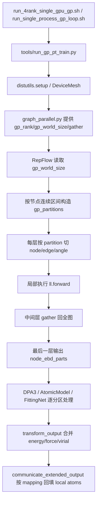

# 当前图并行实现流程说明

配套文档：

- 简版说明： [GRAPH_PARALLEL_CURRENT_IMPLEMENTATION_BRIEF.md](GRAPH_PARALLEL_CURRENT_IMPLEMENTATION_BRIEF.md)
- 模式对照图： [GRAPH_PARALLEL_MODE_COMPARISON.md](GRAPH_PARALLEL_MODE_COMPARISON.md)

本文描述当前分支里“图并行（GP, Graph Parallel）”的实际实现路径，重点回答两个问题：

1. 怎么从 `DeviceMesh` 走到现在实际运行的图并行。
2. 现在的图是如何划分的。

---

## 1. 总体结论

当前实现不是“先做一个通用图划分器，再把每个子图交给独立模型实例”。

当前实现更接近下面这个模式：

- 先用 `torchrun + DeviceMesh` 建立并行拓扑；
- 在拓扑里把 `GP` 这一维解释为“图并行维”；
- 在 `RepFlow` 每一层前，根据当前总节点数，把节点按 **连续区间** 切成 `gp_world_size` 份；
- 每一份子图只保留“中心节点属于本分区”的边和角；
- 每个 GP rank 只算自己的那一份；
- 中间层把局部 `node embedding` 重新 gather 成全图，供下一层继续切分；
- 最后一层不再 gather 成单个张量，而是把各分区结果保留为 `parts`，再交给上层的 fitting / 输出重组逻辑。

换句话说，当前图并行的核心位置不在 trainer，也不在 DDP，而是在 `RepFlow` 的每一层里对 `node/edge/angle` 的局部切片与重组。

---

## 2. 启动入口：从脚本到训练主程序

### 2.1 两种主要启动方式

#### A. 两 GPU / 两 rank 分布式图并行

入口脚本是 [run_4rank_single_gpu_gp.sh](run_4rank_single_gpu_gp.sh)。

默认环境变量是：

- `DP_GP_EXEC_MODE=distributed`
- `DP_GP_SIZE=2`
- `DP_DP_SIZE=1`
- `DP_PP_SIZE=1`
- `DP_EP_SIZE=1`
- `CUDA_VISIBLE_DEVICES=0,1`

也就是默认拓扑：

$$
PP = 1, \quad DP = 1, \quad EP = 1, \quad GP = 2
$$

脚本最终调用的是：

- `python -m torch.distributed.run`
- 再进入 [tools/run_gp_pt_train.py](tools/run_gp_pt_train.py)

#### B. 单进程串行模拟图并行

入口脚本是 [run_single_process_gp_loop.sh](run_single_process_gp_loop.sh)。

默认环境变量是：

- `DP_GP_EXEC_MODE=single-process-loop`
- `DP_GP_SIM_WORLD_SIZE=2`

这表示：

- 不启动多个 rank；
- 只在一个进程里，用 `for` 循环串行执行两个子图；
- 用来模拟“如果 GP world size 是 2，会怎么分图、怎么逐块执行”。

---

## 3. 从 launcher 到 `DeviceMesh`

### 3.1 `tools/run_gp_pt_train.py` 做了什么

当前统一入口是 [tools/run_gp_pt_train.py](tools/run_gp_pt_train.py)。

它主要做三件事：

1. 把仓库根目录插入 `sys.path`，确保优先用本仓库代码；
2. 如果是分布式模式，则调用仓库自己的 `distutils.py` 完成 GP 初始化；
3. 再调用 DeePMD 的 PyTorch CLI 入口。

关键逻辑在 [tools/run_gp_pt_train.py](tools/run_gp_pt_train.py#L63-L118)：

- 读取 `WORLD_SIZE / DP_GP_SIZE / DP_DP_SIZE / DP_PP_SIZE / DP_EP_SIZE`
- 检查拓扑是否满足

$$
PP \times DP \times EP \times GP = WORLD\_SIZE
$$

- 然后调用仓库版 `distutils.setup(...)`

这一步是“从 shell 脚本配置的拓扑”走到“PyTorch 分布式通信组”的桥梁。

---

## 4. `DeviceMesh` 如何映射到图并行

### 4.1 `distutils.py` 里的 mesh 建立

核心实现在 [distutils.py](distutils.py#L123-L205)。

非 FSDP 情况下，当前代码建立的是 4 维 mesh：

$$
(pp, dp, ep, gp)
$$

对应代码：

- `mesh_dim_names=("pp", "dp", "ep", "gp")`
- shape 为 `(pp_size, dp_size, ep_size, gp_size)`

以当前默认两卡图并行为例：

$$
(1, 1, 1, 2)
$$

这表示：

- `pp` 维只有 1 个 stage；
- `dp` 维只有 1 个 rank；
- `ep` 维只有 1 个 rank；
- `gp` 维有 2 个 rank；
- 真正“并起来”的只有 `gp` 这一维。

### 4.2 mesh 中抽出的 group

在 [distutils.py](distutils.py#L145-L183) 中，代码从 mesh 中取出：

- `_PP_GROUP`
- `_DP_GROUP`
- `_EP_GROUP`
- `_GP_GROUP`

图并行直接对应的是：

- `_GP_GROUP = mesh.get_group(mesh_dim="gp")`

也就是说，**图并行 rank 集合，本质上就是 DeviceMesh 中 `gp` 这一维上的通信组。**

### 4.3 为什么还要有 `DP×GP` 这样的组合组

代码还尝试构造：

- `dp_gp`
- `dp_ep_gp`
- `dp_ep`

见 [distutils.py](distutils.py#L166-L183)。

这些组合组的作用不是“切图”，而是服务于更高层的训练语义，例如：

- 参数同步；
- 数据划分；
- 在纯 GP 或混合并行时决定哪些 rank 应该共享参数、哪些 rank 应该共享数据。

在当前最常见的纯 GP 情况：

$$
DP = 1, \; EP = 1, \; GP = 2
$$

PyTorch 2.3 下对 tuple flatten 的支持不稳定，所以代码有一个回退逻辑：

- `_DP_GP_GROUP = _GP_GROUP`
- `_DP_GP_EP_GROUP = _GP_GROUP`
- `_DATA_GROUP = _DP_GROUP`

也就是：

- “DP×GP 组合组”直接退化成 GP 组；
- 数据组仍然是 size=1 的 DP 组。

这使得“纯 GP 两卡”可以先跑起来。

---

## 5. `graph_parallel.py` 的作用

`DeviceMesh` 初始化之后，业务代码并不直接到处访问 `distutils.py` 的全局变量，而是通过 [graph_parallel.py](graph_parallel.py) 做一层包装。

这层包装主要提供三类能力：

1. 判断当前是否启用了图并行；
2. 获取当前 `gp_rank` / `gp_world_size`；
3. 提供 gather / reduce 这样的 GP 通信原语。

关键函数：

- [graph_parallel_enabled()](graph_parallel.py#L42-L49)
- [get_gp_rank()](graph_parallel.py#L52-L57)
- [get_gp_world_size()](graph_parallel.py#L60-L65)
- [gather_node_tensor()](graph_parallel.py#L91-L119)
- [reduce_graph_tensor()](graph_parallel.py#L122-L133)

这里非常关键的一点是：

- 如果 `distutils.py` 已经初始化成功，则优先走仓库自己的 GP 后端；
- 否则才退化到普通 `torch.distributed`；
- 再不行才使用 mock world size。

所以业务层只要调用 `graph_parallel.get_gp_rank()`，就不必关心底层到底是单进程模拟、普通 dist，还是 DeviceMesh 后端。

---

## 6. 真正切图的地方：`RepFlow`

### 6.1 当前切图发生在 `repflows.py`

当前图划分的核心代码在 [deepmd/pt/model/descriptor/repflows.py](deepmd/pt/model/descriptor/repflows.py#L720-L843)。

这是整个实现最关键的一段。

### 6.2 当前不是“基于拓扑优化”的图划分，而是“按节点连续区间切”

切分步骤如下：

1. 先取节点总数：

   - `gp_num_nodes = node_ebd.shape[0]`

2. 再按 `gp_world_size` 做均衡切分：

   - `graph_parallel._balanced_partition_sizes(...)`
   - `graph_parallel._build_partition_offsets(...)`

如果总节点数是 $N$，图并行份数是 $P$，那么每份大小近似为：

$$
\left\lfloor \frac{N}{P} \right\rfloor \text{ 或 } \left\lceil \frac{N}{P} \right\rceil
$$

3. 得到每个 rank 的连续节点区间：

$$
[local\_start, local\_end)
$$

例如两份时，就是把节点序列近似一分为二。

### 6.3 分区依据是什么

当前分区依据不是图聚类、不是 METIS，也不是边割最小化。

当前依据是：

- **节点编号的连续区间切分**。

也就是说，现在的“子图”其实更准确地说是：

- 以一段连续节点 ID 为中心节点集合；
- 选出这些中心节点相关的边与角；
- 把这一局部工作量交给一个 GP rank。

这是一个实现成本低、便于验证正确性的第一版方案。

---

## 7. 边和角是怎么跟着分的

### 7.1 边的划分

在 [repflows.py](deepmd/pt/model/descriptor/repflows.py#L798-L804) 中：

- `edge_mask = (edge_index[0] >= local_start) & (edge_index[0] < local_end)`

意思是：

- 只保留那些 **源节点 / 中心节点** 落在当前分区节点区间内的边。

因此当前边的归属规则是：

- 边跟随它的中心节点走。

### 7.2 角的划分

在 [repflows.py](deepmd/pt/model/descriptor/repflows.py#L805-L829) 中：

- `angle_mask` 同样基于 `angle_index[0]`；
- 即角也跟随其中心节点所在分区。

### 7.3 为什么还要 remap angle 的 edge reference

角张量里通常会引用两条边的编号。

但是边已经被局部筛过了：

- 全局边编号不再适用于当前分区；
- 所以代码构造了 `edge_remap`；
- 把角里引用的全局 edge id 重映射为局部 edge id。

这部分逻辑在 [repflows.py](deepmd/pt/model/descriptor/repflows.py#L811-L828)。

它做了两件事：

1. 过滤掉引用非法边编号的角；
2. 把角里引用的边编号改写为局部编号。

所以当前子图的本质是三元组：

- 局部节点区间；
- 这些节点对应的局部边集合；
- 这些边可解释的局部角集合。

---

## 8. 每一层 `RepFlow` 是怎么跑图并行的

### 8.1 当前层间策略

在 [repflows.py](deepmd/pt/model/descriptor/repflows.py#L845-L1091) 中，每个 `RepFlow` layer 都会重复下面的流程：

1. 按当前 `gp_partitions` 选取本 rank 的局部子图；
2. 对局部 `edge_ebd / angle_ebd / h2 / sw / a_sw` 做切片；
3. 调用 `ll.forward(...)` 做本层局部计算；
4. 取出当前分区对应的 `node_ebd_local`；
5. 如果不是最后一层，则把各 rank 的局部 `node_ebd_local` gather 回整图；
6. 如果是最后一层，则保留为 `node_ebd_parts` 列表，继续往上层传。

### 8.2 分布式 GP 模式

在 `distributed_gp=True` 时，逻辑是：

- 当前 rank 读取 `gp_rank = graph_parallel.get_gp_rank()`；
- 只拿 `gp_partitions[gp_rank]`；
- 本 rank 只算自己的那一块；
- 非最后一层通过 `graph_parallel.gather_node_tensor(...)` 把各块拼回全图。

这一步的直观含义是：

> 每层都是“局部算 -> 全局拼 -> 再切下一层”。

当前实现不是“第一层切完后，全程只保留局部图到最后”。

### 8.3 单进程 loop 模式

在 `distributed_gp=False` 且 `DP_GP_EXEC_MODE=single-process-loop` 时，逻辑是：

- 不启动多个 rank；
- 直接在一个进程里：

```text
for partition in gp_partitions:
    取局部子图
    跑 ll.forward(...)
    收集局部输出
```

- 非最后一层用 `torch.cat(node_ebd_parts, dim=0)` 拼回全图；
- 最后一层则保留 `node_ebd_parts`。

因此：

- 单进程模式是“串行模拟分布式图并行”；
- 分布式模式是“各 rank 并行各算一块，再通信拼回”。

两者的算法结构尽量保持一致，差别主要在于：

- 单进程：`for` 循环 + `torch.cat`
- 多进程：每 rank 单块执行 + `gather_node_tensor`

---

## 9. `RepFlow` 结果是怎么往上交的

`RepFlow` 本身并不直接给最终能量和力。

它给上层的是 descriptor 级别结果。

### 9.1 DPA3 层

在 [deepmd/pt/model/descriptor/dpa3.py](deepmd/pt/model/descriptor/dpa3.py#L510-L572) 中：

- `self.repflows(...)` 如果返回的是普通张量，就走普通路径；
- 如果返回的是带 `gp_partitions` 的字典，就认定进入 GP 模式。

DPA3 在 GP 模式下会做一件额外事情：

- 如果 `concat_output_tebd=True`，就把输入 type embedding 的局部切片也按相同分区方式切出来；
- 然后和每个分区的 `node_ebd_part` 做 concat。

所以 DPA3 的作用是：

- 保持每个分区的 descriptor 结构完整；
- 让上层 fitting net 能逐分区继续处理。

### 9.2 Atomic model 层

在 [deepmd/pt/model/atomic_model/dp_atomic_model.py](deepmd/pt/model/atomic_model/dp_atomic_model.py#L265-L329) 中：

- 对每个分区的 `node_ebd_part` 单独调用 `fitting_net(...)`；
- 得到 `fit_ret_parts`；
- 再把 `gp_partitions` 和 `local_partition_indices` 一起返回。

所以当前 fitting net 也是“按分区逐块执行”的。

### 9.3 Base atomic model 层

在 [deepmd/pt/model/atomic_model/base_atomic_model.py](deepmd/pt/model/atomic_model/base_atomic_model.py#L263-L315) 中：

- 对每个分区做 `apply_out_stat(...)`；
- 把 atom mask 也按分区切开；
- 返回 `mask_parts`。

这一步是把输出统计和有效原子 mask 对齐到每个子图。

---

## 10. 最后的合并：从分区结果回到模型输出

### 10.1 `make_model.py` 中的第一次合并

在 [deepmd/pt/model/model/make_model.py](deepmd/pt/model/model/make_model.py#L299-L365) 中：

- 把多个 `fit_ret_parts` 先拼成 `merged_atomic_ret`；
- 如果是分布式 GP，并且底层 distutils GP 已可用，则进一步用 `graph_parallel.gather_node_tensor(...)` 跨 rank gather。

这里的合并策略是：

- `batch`：按 batch 维拼；
- 原子量：按原子维拼；
- `mask_parts`：也按原子维拼。

### 10.2 `fit_output_to_model_output()`

在 [deepmd/pt/model/model/transform_output.py](deepmd/pt/model/model/transform_output.py#L202-L299) 中：

对于 GP 模式，代码会：

1. 逐分区处理 `fit_ret_parts`；
2. 在每个分区内计算局部 reduce 结果；
3. 在每个分区内对局部 `coord_ext` 求导，得到局部 force / virial；
4. 然后再做跨分区合并：
   - 能量：求和；
   - force：拼接；
   - virial：求和；
   - 原子量：拼接。

当前这一层的设计思想是：

- “先局部算导数，再按物理量语义合并”。

### 10.3 `communicate_extended_output()`

在 [deepmd/pt/model/model/transform_output.py](deepmd/pt/model/model/transform_output.py#L359-L441) 中：

还要做最后一步：

- 把定义在 extended atoms 上的输出，按 `mapping` scatter 回 local atoms。

核心操作是：

- 利用 `mapping` 构造 `mapping_r` / `mapping_c`；
- 用 `torch.scatter_reduce(...)` 把导数从扩展原子域回填到局部原子域。

这一步是“图并行 / 邻域扩展域”与“模型最终本地原子输出”之间的最后桥梁。

---

## 11. 从 `DeviceMesh` 到图并行，整条链路可以怎么理解

可以把它概括成下面 7 步：

### 第 1 步：launcher 定义拓扑

脚本里定义：

$$
(PP, DP, EP, GP)
$$

例如当前最常见的是：

$$
(1, 1, 1, 2)
$$

### 第 2 步：`run_gp_pt_train.py` 校验拓扑并调用 `distutils.setup()`

这一层把 shell 环境变量变成真正的分布式初始化参数。

### 第 3 步：`distutils.py` 建立 `DeviceMesh`

这里把 rank 放进四维 mesh，并抽出 `_GP_GROUP`。

### 第 4 步：`graph_parallel.py` 对外提供统一 GP 接口

上层业务只需要问：

- 当前是不是 GP 模式？
- 我是第几个 `gp_rank`？
- GP 总共有几个分区？
- 怎么 gather 本层局部节点张量？

### 第 5 步：`repflows.py` 用 `gp_world_size` 对节点做连续区间切分

这是当前真正的“图划分”。

### 第 6 步：每层 `RepFlow` 局部计算 + 中间层重组

- 分布式：每个 rank 各算一块；
- 单进程：一个进程里用 `for` 循环依次算每一块。

### 第 7 步：descriptor/fitting/output 层逐步把分块结果合并回标准 DeePMD 输出

最后重新得到：

- `energy`
- `force`
- `virial`
- `atom_energy`

---

## 12. 当前图划分方案的特点

### 12.1 优点

1. 实现简单，容易验证；
2. 单进程 loop 和分布式模式的结构接近；
3. 便于逐层对比“全图串行”与“图并行分块”是否一致；
4. 不依赖额外图划分库。

### 12.2 局限

1. 当前不是最优图划分，可能切断很多边；
2. 连续区间切分只利用了“节点编号顺序”，没有利用真实图结构；
3. 中间层每层都要 gather 回全图，通信开销可能偏大；
4. 输出重组路径较复杂，尤其 force/virial 的映射很容易出 shape/index 问题；
5. 当前 `repflows.py` 里仍有较多调试打印，甚至还保留了 `ipdb.set_trace()`，这会影响正常训练流程。

---

## 13. 当前实现里最值得记住的两个核心点

### 核心点 A：图并行的“并行维”来自 `DeviceMesh` 的 `gp` 维

不是 trainer 自己发明了一个 rank 概念，而是：

- `DeviceMesh` 定义了 `gp` 这一维；
- `distutils.py` 从这维抽出 `_GP_GROUP`；
- `graph_parallel.py` 再把它包装成业务层可用的 `gp_rank` / `gp_world_size`。

### 核心点 B：当前图划分是“按节点连续区间切”，不是图算法意义上的最优切分

也就是说，当前“子图”的定义更像：

> 选择一段中心节点区间，再收集这些中心节点拥有的边和角。

这是一个工程上便于落地和调试的第一版方案。

---

## 14. 一个简化的流程图



---

## 15. 如果要继续演进，下一步通常会是什么

如果后续要把这套实现做得更“像真正的图并行”，通常会继续沿着下面方向改：

1. **更好的图划分器**：从连续区间切分，升级到基于图结构的 partition；
2. **减少层间全量 gather**：让局部图状态尽可能跨层保留；
3. **更清晰的局部/全局索引语义**：统一 `mapping`、`extended_coord`、`local_start/local_end` 的定义；
4. **把调试代码从主路径里清掉**：移除 `print` 和 `ipdb.set_trace()`；
5. **建立串行 vs GP 的逐层数值对照工具**：验证每层输出和最终 force 是否一致。

---

## 16. 一句话总结

当前版本的图并行实现可以概括为：

> 用 `DeviceMesh` 的 `gp` 维定义图并行 rank；在 `RepFlow` 内按节点连续区间把图切成若干份；每层局部计算后在中间层重组、在最后一层保留分区结果，再由 DPA3 / atomic model / output transform 逐步合并回标准 DeePMD 输出。
